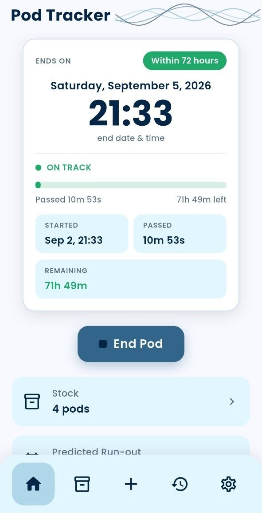
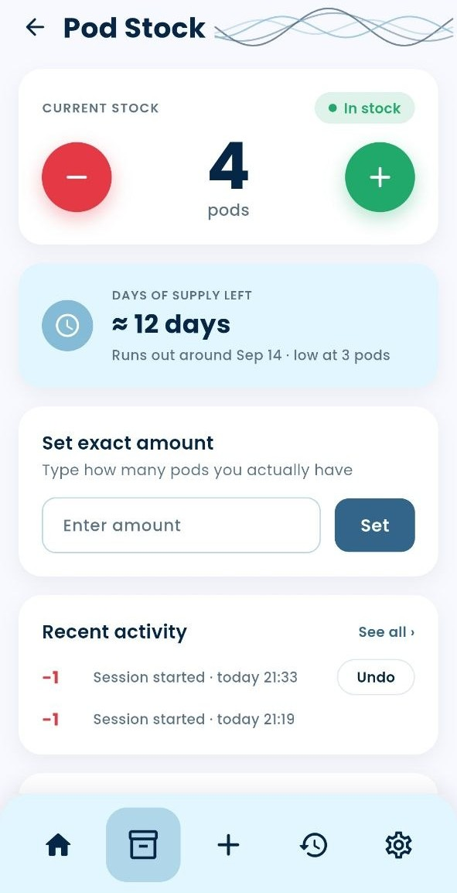
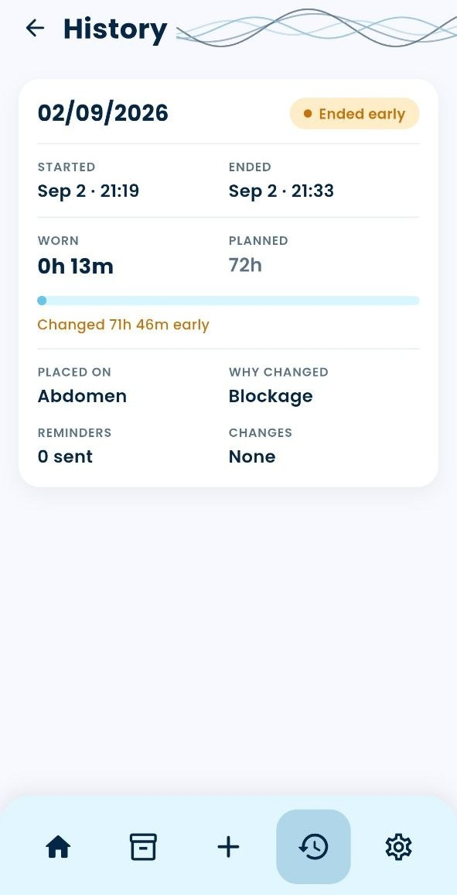
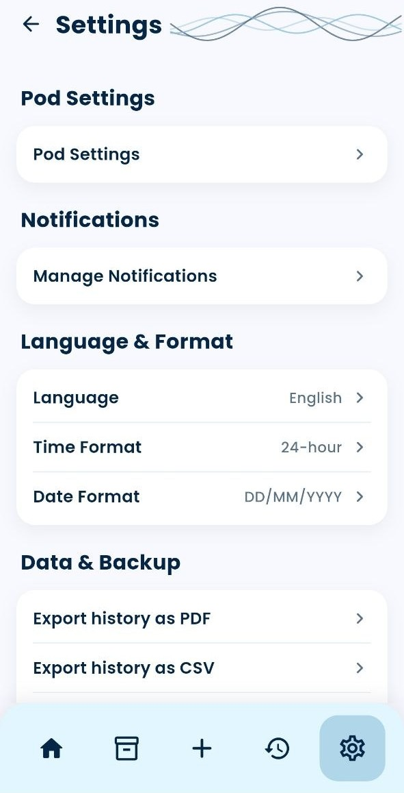
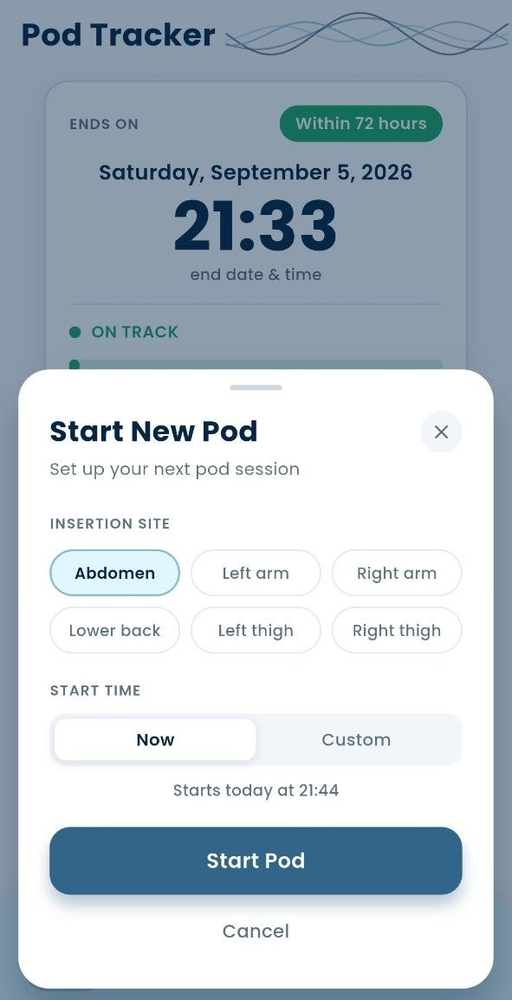

# Pod Tracker

A Flutter app for people on insulin pump therapy (Omnipod-style patch pumps) to track pod wear time, manage supply, and stay on top of site rotation — built as a fully local, offline-first companion app with no backend and no account required.

<p align="center">
  
  
  
  
</p>

## Screenshots

<!-- Replace these with real screenshots, e.g. assets/screenshots/home.png -->
<p align="center">
  
  
  
  
  
</p>

## Overview

Pod Tracker keeps a live countdown for the pod currently being worn, warns before it expires, and logs every session once it ends. Alongside the countdown it tracks pod stock so the user knows when to reorder, and lets them build their own set of reminders (before expiry, after the grace window, low stock, daily check-ins, site rotation) instead of relying on hard-coded alerts.

Everything runs on-device: state is held in memory via a single `ChangeNotifier` controller and persisted to `shared_preferences` as JSON, and reminders are scheduled as real local notifications with `flutter_local_notifications` — no server, no sign-in, no network dependency.

## Features

**Pod session tracking**
- Live countdown from pod start to its rated wear time (default 72h), with a distinct visual state for on-track / grace period / overdue
- Configurable pod duration and grace period per pod type
- One-tap "End Pod" and "Start Pod" flow, including a custom start-time picker for logging a pod applied earlier
- Starting a new pod while one is active automatically closes the old one out as "Replaced" instead of discarding it

**Stock management**
- Increment/decrement stock with debounced activity logging (rapid taps collapse into one log entry instead of spamming the log)
- "Set exact amount" for reconciling stock by hand
- Undo the last stock change
- Estimated days-of-supply and projected run-out date based on usage
- Full stock activity log (restocks, session consumption, manual corrections)

**Session history**
- Every completed pod is recorded with start/end time, actual wear duration, insertion site, and how it ended (completed on time, ended early, worn too long)
- Clear history independently of stock and settings

**Custom notifications**
- User-defined reminder rules, each with its own trigger:
  - Before pod expiry / before grace period ends / after the pod becomes overdue
  - Low stock (fires once, the moment stock crosses the threshold)
  - Daily check-in reminder
  - Recurring site-rotation reminder (every N days)
- Rules can be added, edited, toggled, or removed independently, each scheduled as a real local notification and kept in sync as the active pod session changes

**Settings**
- Pod type / default duration / grace period
- Low-stock threshold and reorder reminder toggle
- Notification behavior: sound, vibration, critical alerts, hide previews, quiet hours, snooze duration
- 12h/24h time format and date format, reflected everywhere in the app
- Reset to factory defaults without touching stock or history

## Tech stack

| Layer | Choice |
|---|---|
| Framework | Flutter (Material 3) |
| Language | Dart |
| State management | Plain `ChangeNotifier` + `ListenableBuilder` — no external state package |
| Persistence | `shared_preferences`, values JSON-encoded for lists/objects |
| Local notifications | `flutter_local_notifications` + `timezone` / `flutter_timezone` for correct scheduling across time zones |
| Fonts | Poppins, bundled locally as app assets (no runtime font fetch) |

## Architecture

State lives in one `PodController` (a `ChangeNotifier`) that owns the active pod session, stock, activity log, session history, notification rules, and every setting. The UI reads it through `ListenableBuilder`/`ValueListenableBuilder` — deliberately no `provider`, `riverpod`, or `bloc` dependency, since a single controller was enough for this app's scope and keeps the dependency footprint minimal.

A few things worth calling out for anyone reading the code:

- **Per-second UI cost is isolated.** The countdown's 1-second tick lives on its own `ValueNotifier` (`secondTick`), separate from the controller's main `notifyListeners()`, so only the countdown digits rebuild each second — not the whole Home screen, and not other tabs at all (gated by the active tab via `TabListenableBuilder`).
- **Writes are debounced, not per-keystroke.** Stock +/- taps and settings changes are coalesced (400ms save debounce, 3s stock-log debounce, 600ms notification-resync debounce) so rapid interaction doesn't spam disk writes or the notification scheduler.
- **Tabs are an `IndexedStack`, not routes.** Switching tabs never rebuilds a fresh screen or replays a transition — each tab keeps its scroll position and local state, matching how the four bottom-nav destinations are meant to feel.
- **Notification rules are just data.** Each `NotificationRule` is declarative (a trigger + offset/time-of-day/recurrence), decoupled from the pod session it fires relative to; `NotificationService.sync` recomputes concrete fire times from current rules + session state whenever either changes.

```
lib/
├── main.dart                     # App entrypoint, MaterialApp + theme wiring
├── screens/                      # One file per screen (Home, Stock, History, Settings, ...)
├── widgets/                      # Reusable UI pieces (sheets, bottom bar, transitions, cards)
├── state/                        # PodController, PodSession/SessionRecord models, NotificationRule
├── services/                     # NotificationService (flutter_local_notifications wrapper)
└── theme/                        # Design tokens: colors, text styles, formatting helpers
```

## Design

The color palette and type scale come from a Figma design file and are centralized in `lib/theme/tokens.dart` as `AppColors` / `AppText` — no hard-coded colors or one-off `TextStyle`s scattered through the screens. Status colors (on-track green, grace amber, overdue red) are shared between the countdown card, session history badges, and stock alerts so the same state always reads the same way anywhere in the app.

## Getting started

**Prerequisites**: [Flutter SDK](https://docs.flutter.dev/get-started/install) (Dart SDK ^3.12.2, per `pubspec.yaml`), and an Android/iOS device or emulator.

```bash
# Install dependencies
flutter pub get

# Run on a connected device or emulator
flutter run

# Run the test suite
flutter test
```

## Status

This is a solo portfolio project built to demonstrate a complete, polished Flutter app: custom local state management, real local notification scheduling, JSON persistence, and a design system translated faithfully from Figma. It is not published to an app store and is not affiliated with Insulet/Omnipod or any other pump manufacturer.
